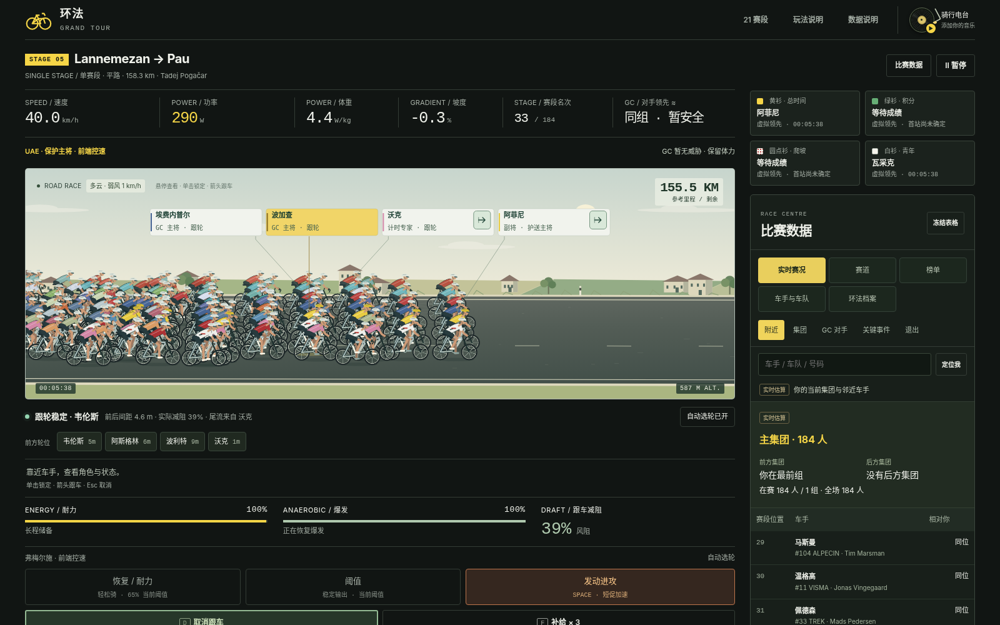

# Grand Tour

An unofficial, single-file browser game about professional road-cycling stage racing.

[**Play Grand Tour V12**](https://seiya058904.github.io/Grand-Tour/) · [Watch the finish-ceremony capture](Grand-Tour-V12/Grand-Tour-V12-finish-ceremony.mp4)

## The game

Race one stage or take on a full 21-stage Grand Tour. Lead a 184-rider field through flat, hilly, mountain, individual time-trial, and team time-trial stages. Manage effort, drafting, attacks, and feeding while reacting to team tactics and changing race groups. Stage results, general classification, sprint and mountain points, jerseys, and winner ceremonies are all part of the tour.

## Play

- **In a browser:** [Open the GitHub Pages game](https://seiya058904.github.io/Grand-Tour/).
- **Locally:** download [`grand-tour-v12.html`](Grand-Tour-V12/grand-tour-v12.html) and open it in a modern browser. The game needs no installation, build step, server, external libraries, or network connection.

Use the in-game help for controls. Progress is stored in browser-local storage; different browsers or local file locations may keep separate saves.

## V11 save compatibility

V12 retains the V9 save format and storage key. Before importing V11 progress, export a backup in V11 and keep the original file. V12 changes road-race tactics, so an unfinished race may produce different results after it is resumed. Time-trial behavior is covered separately in the validation report.

## V12 status and validation

V12 is the current playtest build. The bundled report records 255 named checks with no failures, while final visual and feel acceptance remains for human playtesting. The report also documents browser and device coverage that has not been verified.

See the [V12 delivery report](Grand-Tour-V12/V12-REPORT.md), [optional test instructions](Grand-Tour-V12/tests/README.md), [validation evidence](Grand-Tour-V12/evidence/verification-summary.json), and [V12 package notes](Grand-Tour-V12/README.md).

## About and license

This is an independent, unofficial project. It is not affiliated with or endorsed by the Tour de France organizers, professional cycling teams, or riders represented in the game. No open-source license has been selected.
